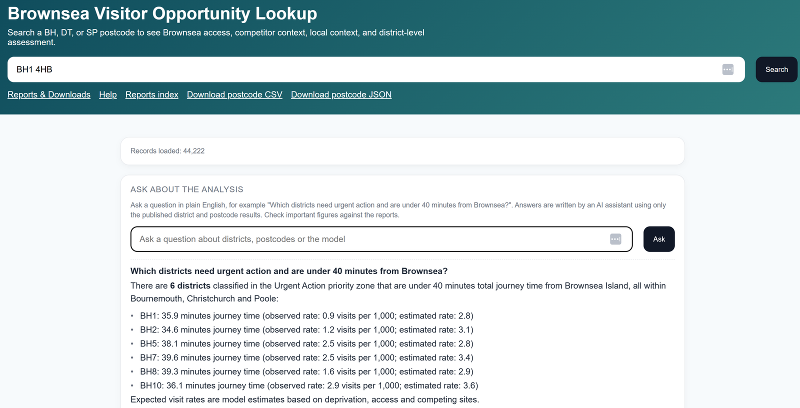

# Brownsea Visitor Access & Equity Model

This project looks at who visits Brownsea Island and who doesn't, and what might be keeping people away, so that outreach can be aimed at the areas that would benefit most. It groups every postcode district in the BH, DT and SP areas by how much need there is locally and how often residents visit, so that high-need areas with few visits stand out. A model then estimates the visit rate each district would be expected to have, given its deprivation, how long the journey to Brownsea takes, and whether there is another National Trust site closer to home that residents might choose instead. Comparing that with actual visits shows where a district falls short.

**Live app with AI assistant:** https://brownsea-visitor-access.onrender.com

**Static version (no assistant):** https://rollinse.github.io/brownsea-visitor-access-equity-model/

The first link is on a free hosting plan, so the first load can take about a minute.

**About this version.** This is a public, data-safe copy of a tool I built for the National Trust. It contains no visitor or member records. Everything shown here is summarised at postcode-district level, so no individual or household can be identified. Shared with the National Trust's agreement.



## What you can do with it

* Look up any of 44,222 postcodes and see the journey to Brownsea (drive plus ferry), the nearest competing National Trust site, local deprivation, and how the surrounding district is doing.
* See how the 48 districts are grouped into five priority zones, from Urgent Action to Maintain, each with a suggested type of intervention.
* Read the [reports](https://rollinse.github.io/brownsea-visitor-access-equity-model/reports/index.html) and download the results as CSV.
* Ask the AI assistant a question in plain English, on the hosted version.

Journey times are planning estimates, not live travel times.

## How it works

1. **Data.** Each district is described by ten features: the total journey time to Brownsea, the drive time to the nearest competing National Trust site, the free school meal rate, and deprivation measures from the IMD (overall, income, geographical barriers and wider barriers, plus the share of residents living in the most, moderately and least deprived areas). Drive times come from OpenRouteService.
2. **Model.** Seven model types were compared: Ridge, Poisson GLM, random forest, gradient boosting, XGBoost, LightGBM and CatBoost, with and without tuning, plus an ensemble of the best three. They are trained on the 48 districts in the study area and scored with cross-validation grouped by local authority, so each district is predicted by a model that has not seen its authority. Ridge regression performed best, with a mean absolute error of 1.16 visits per 1,000 residents and an R² of 0.67. The full comparison is in the [model performance report](https://rollinse.github.io/brownsea-visitor-access-equity-model/reports/model_performance.html).
3. **Classification.** Each district gets a need score: 70% from the share of residents in the most deprived areas (IMD deciles 1 to 4) and 30% from the free school meal rate. The need score and the observed visit rate together decide the priority zone. For example, high need with fewer than 4 visits per 1,000 residents is Urgent Action. The model's expected rate is shown alongside, with SHAP values to show which features raise or lower it for each district.
4. **Outputs.** The pipeline writes a postcode lookup, a district table and a set of HTML reports. Both apps read these files.

## The two apps

| | Static app | Flask app |
|---|---|---|
| Where | GitHub Pages | Render |
| Needs a server | No | Yes |
| Postcode lookup and reports | Yes | Yes |
| AI assistant | No | Yes |

The assistant needs a server to keep its API key private, so it is only in the Flask app.

## AI assistant

The Flask app has an "Ask about the analysis" box. You can type a question such as "Which districts need urgent action and are under 40 minutes from Brownsea?" and get a short written answer.

The assistant is an LLM agent built on Google's Gemini API. It does not answer from memory. For each question it picks from a small set of read-only tools, the tools look up the published results, and the model writes its answer from what they return.

| Tool | Reads |
|---|---|
| `lookup_postcode` | the postcode lookup |
| `get_district`, `query_districts`, `aggregate_districts` | the district table |
| `get_model_performance` | the model comparison |
| `get_definitions` | the priority zone and need tier definitions |

* Counts, totals and averages are worked out in Python by the tools, not by the model.
* The tools only read the published postcode and district outputs. The assistant never sees visitor or member records.
* Each answer lists which data it used.

Gemini's free tier has low daily limits per model, so if one model is over its limit or busy the assistant falls back to the next in a list.

| Setting | Default | Purpose |
|---|---|---|
| `GEMINI_API_KEY` | none | Turns the assistant on |
| `BROWNSEA_AGENT_MODEL` | `gemini-3.8-flash` | First model to try |
| `BROWNSEA_AGENT_FALLBACK_MODELS` | `gemini-3.7-flash,gemini-3.6-flash,gemini-3.5-flash,gemini-3.5-flash-lite` | Models to fall back to, in order |
| `BROWNSEA_AGENT_RATE_PER_MIN` | `10` | Questions allowed per client per minute |

## Run it yourself

The app runs straight after cloning, using the results published in `docs/`.

```bash
git clone https://github.com/RollinsE/brownsea-visitor-access-equity-model.git
cd brownsea-visitor-access-equity-model
pip install -r requirements/app.txt
python run_postcode_app.py
```

Then open http://localhost:8000.

To turn on the assistant, get a free key from https://aistudio.google.com/apikey and set it before starting the app:

```bash
export GEMINI_API_KEY=your-key
```

On Windows, use `$env:GEMINI_API_KEY="your-key"` in PowerShell or `set GEMINI_API_KEY=your-key` in Command Prompt.

You can also ask a question from the command line, or check the assistant's answers against values calculated from the data:

```bash
python -m src.agent --show-tools "How many districts are in each priority zone?"
python scripts/eval_agent.py
```

The hosted version is deployed on Render from `render.yaml`.

## Rebuilding the analysis

The pipeline runs in five stages: data preparation, model training, framework definitions, analysis and reports, and the postcode lookup. It needs the private visit data, so it cannot be rerun from this repository alone. The commands, release checks and Colab notes are in [PIPELINE.md](PIPELINE.md).

## Repository layout

```text
├── app/                 # Flask app
├── assets/              # Images for this README
├── data/reference/      # Public reference data
├── docs/                # Static app and published results (GitHub Pages)
├── notebooks/           # Colab notebooks
├── requirements/        # Dependency files
├── scripts/             # QA, release and export scripts
├── src/                 # Pipeline and app code
│   └── agent/           # AI assistant: tools, prompt and LLM connections
├── tests/
├── cli.py               # Pipeline entry point
├── render.yaml          # Hosting config for Render
└── run_postcode_app.py  # Starts the Flask app
```

## Data and privacy

The original tool was built using private visitor and member data. None of that data is in this repository or in either live app. The public version only includes the summarised outputs of the analysis, public reference data and the code.

## Tests

```bash
pytest
```

## License

The code is under the MIT License. The private and raw datasets are not part of this repository and are not covered by it.
